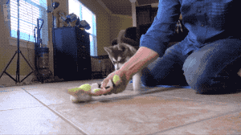
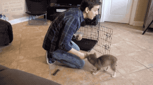
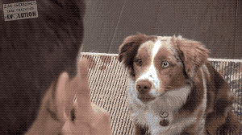

### A Dog Manual

#### Table of Content
* Cost estimates [[Link](#cost-estimate)]
* Preparation Checklist [[Link](#Preparation-Checklist)]
* Potty Train [[Link](#Potty-Train)]

___
#### Cost Estimate
Small dog (per year)
* Vaccine (~100$ a year)
  - Leptospirosis
  - Lyme
  - Bordetella
  - DA2PP
  - Rabies
* Insurance: ~$480 / yr
* Dog food: ~$650 / yr
* Flea tick & heard guard: ~ $270 / yr
* Vet visits ($20), miscellany: $150 / yr
  - crate
  - leash
  - collar
**Total**: $1650 / yr

___
#### Preparation Checklist [[Video](https://www.youtube.com/watch?v=---jcia5ufM)]
* Find out what dog had been eating. Gradually change to anything else.
  - www.petflow.com for food delivery.
* Do not give too much freedom early on. Put a dog crate & leash.
  - Nylon leash is wash-friendly.
* Keep garbage can, electric appliance, small stuff away.
* Get several dog bowl.
  - Stainless still better than plastic. Easy to clean. Difficult to chew.
* Two types of toys:
  - Chew toys: Real bones etc. for chewing; leave it around the house.
  - Training toys: e.g. squeaky toy; for training purpose; no free access.

  ___
#### Potty Train [[Video](https://www.youtube.com/watch?v=7vOXWCewEYM&t=19s)]
* Generalize entire house to be its home.
* Slowly give dog access to the rest of the entire house under supervision.
  - Keep a leash.
* Start with a crate.
  - To return into crate, lure with good. Do not force.
  - After dog gets into crate, do not walk away immediately.
  - At first, place crate next to bed to avoid anxiety.

* After arriving home and waking up, immediately take dog outside for 5~10 minutes.
  - Award dog if it takes a pee/shit outside.
  - Do not punish dog if it pees/shits inside room.
  - Generally it takes 12~13 months.
* Regression is likely in first year -> go back to basics.

___
#### Train Dog not to Bark [[Video](https://www.youtube.com/watch?v=s0A9SpCdRZg)]
Key: do not reward when dog bark. Wait for a period of silence before rewarding.
* If bark, say "no" and pull food away.
* When dog restrains, reward good.
  - Increase the length of silence (0.5s, 1s, 5s).

Teach dog to remain silent when someone knocks on door.
* Start with knocking one time.
* If dog focuses on owner when someone knocks, reward.
Train dog to remain silent when owner is away.
* Exercise dog rigorously in the morning before going to work.
* When dog barks when owner looks away, do not reward.
* Have plenty of chew toys.
